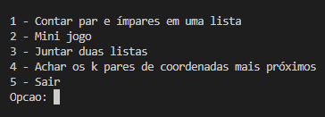
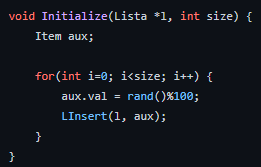
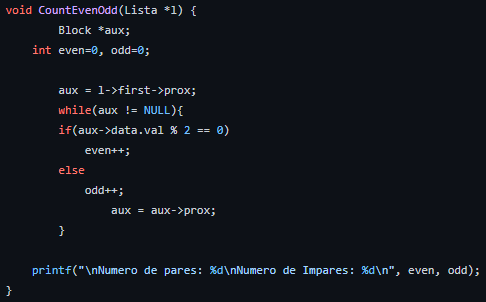
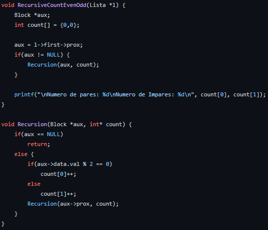
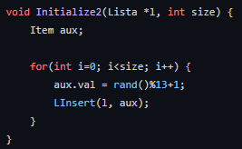
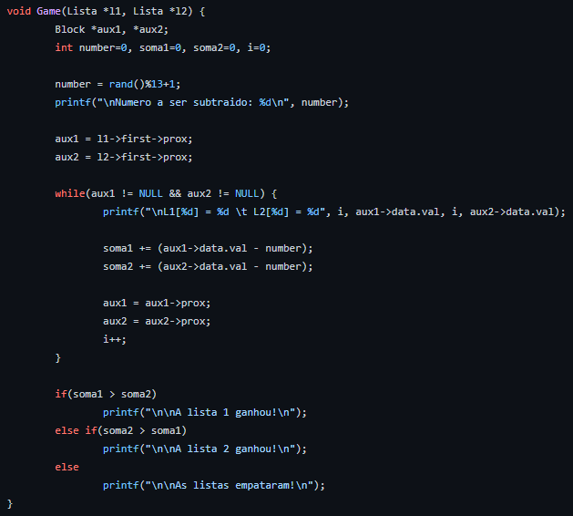
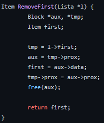
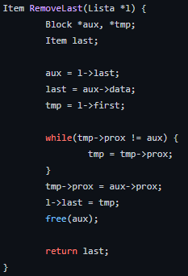
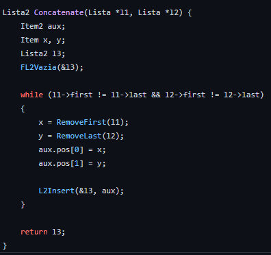

# Problema 1 - Exercícios feitos com lista dinâmica

 
 

 

  Os exercícios do problemas foram feitos com listas dinâmicas, [vide git](<a href="https://github.com/mpiress/dynamic_list">https://github.com/mpiress/dynamic_list</a>),  para facilitar a utilização do usuário foi-se criado um menu onde o mesmo pode escolher qual dos exercícios do Problema 1 ele quer ver o resultado. A figura abaixo mostra o menu criado:
  

    
  

<h2>Problema 1-a</h2>

  Para este exercício foi foi pedido a criação uma função que conta a quantidade de pares e ímpares de uma lista de forma recursiva e não-recursiva. Antes de chamar os métodos é necessário uma lista, para criar está lista o usuário precisa informar o tamanho da lista para então o método Initialize possa encher está lista com valores entre 0-100 aletoriamente. A imagem abaixo apresenta o método Initialize: 
  

    
  

  Com a lista pronta a primeira forma de contar os pares e ímpares é a não recursiva. Para fazer isto foi-se criado o método CountEvenOdd ele recebe uma lista e olha posição por posição da lista se o MOD 2 do valor da posição é 0 o contador de pares aumenta senão contador de ímpares aumenta. A imagem abaixo mostra o método CountEvenOdd: 
  

    
  

  A primeira forma de contar os pares e ímpares é a recursiva. Para fazer ela foi-se criado o método RecursiveCountEvenOdd que só serve para chamar a função recursiva e mostrar os dados. A função recursiva Recursion recebe uma posição da lista e uma vetor de 2 posições de inteiros par armazenar a quantidade de pares e ímpares já contados se o valor da posição for Nulo a função para de se chamar senão ela verifca se a posição é par ou ímpar do mesmo jeito que a função não-recursiva e se chama novamente com a próxima posição da atual. A imagem baixo mostra as funções RecursiveCountEvenOdd e Recursion: 
  

    
  

<h2>Problema 1-b</h2>

  Para este exercício foi foi pedido a criação uma função que faz um mini-jogo com duas listas. Antes de chamar o método é necessário duas listas de tamanhos iguais, para criar essas listas o usuário precisa informar o tamanho delas para então o método Initialize2 possa encher essas listas com valores entre 1-13 aletoriamente. A imagem abaixo apresenta o método Initialize2:
  

    
  

  Após inicializar as listas o metódo game é chamado para primeiro gerar um número entre 1 e 13 e com este número fazer a soma de cada valor das listas menos o número gerado, a soma é separada para cada lista. Com o resultado das somas ganha a lista que tiver a maior soma no final, se a soma for igual para duas listas elas empatam. A figura abaixo mostrao metódo game:  
  

    
  

<h2>Problema 1-c</h2>

  Para este exercício foi foi pedido a criação uma função que junta duas listas. Antes de chamar a função é necessário duas listas de tamanhos iguais, para criar essas listas o usuário precisa informar o tamanho delas para então o método Initialize possa encher essas listas com valores entre 0-100 aletoriamente. A imagem abaixo apresenta o método Initialize: 
  

    
  

  Antes de explicar como as listas são juntadas duas funções extras são necessárias para entender como as listas são juntadas. Elas são RemoveFirst e RemoveLast, a primeira função remove da lista a primeira posição e retorna o valor desta posição e a segunda função remove da lista a última posição e retorna o valor desta posição. As figuras abaixo mostra os métodos RemoveFirst e RemoveLast:
  

    
    
  

  Com os as duas funções acima explicadas podemos agora entender como a função que junta as listas funciona. O nome desta função é Concatenate ela recebe as duas listas e enquanto elas estiverem com algo a seguinte operação ocorre: primeiro é recebe o valor da função RemoveFirst com a primeira lista, depois recebe o valor da função RemoveLast com a segunda lista e por último juntas esses valores e os adiciona em uma terceira lista. Quando as duas listas inicias estiverem vazias a terceira lista é retonada. A imagem abaixo mosta a função Concatenate:
  

    
  

<h2>Problema 1-d</h2>

  Para esse problema foi pedido a criação de uma função que receba pares de uma lista sendo essas divididas em Lista X e Lista Y, sendo esses valores maiores do que 0.
  

    
  

  Logo depois de criar as Listas a função deverá fazer o calculo euclidiano usando os valores respectivos dessas listas.
  

     
  

  Por fim essa função deverá achar os K pares mais proximos do resultado dessa euclidiana, para isso usamos a lógica de ordenar a Lista com resultados Euclidianos e mostrar os K resultantes atravez desse resultado:
  

    
    
  

# Compilação e Execução

O progama disponibilizado possui um arquivo Makefile que realiza todo o procedimento de compilação e execução. Para tanto, temos as seguintes diretrizes de execução:

| Comando                |  Função                                                                                           |                     
| -----------------------| ------------------------------------------------------------------------------------------------- |
|  `make clean`          | Apaga a última compilação realizada contida na pasta build                                        |
|  `make`                | Executa a compilação do programa utilizando o gcc, e o resultado vai para a pasta build           |
|  `make run`            | Executa o programa da pasta build após a realização da compilação                                 |

Trabalho realizado por Gabriel Teixeira, Lívia Gonçalves, Marcus Vinícius e Augusto Bebiano - Maio/2022
