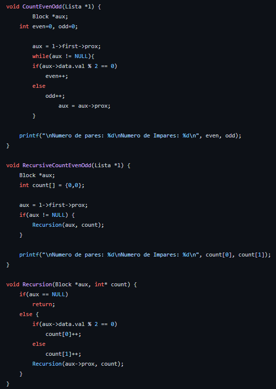
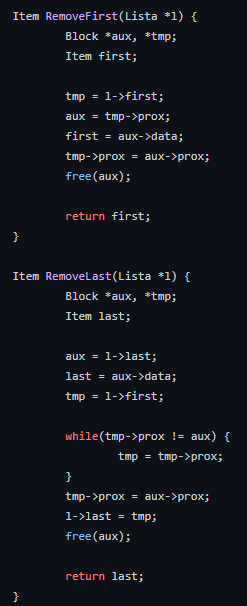

# Problema 1 - Exercícios feitos com lista dinâmica

 
 

 

  Os exercícios do problemas foram feitos com listas dinâmicas, [vide git](<a href="https://github.com/mpiress/dynamic_list">https://github.com/mpiress/dynamic_list</a>),  para facilitar a utilização do usuário foi-se criado um menu onde o mesmo pode escolher qual dos exercícios do Problema 1 ele quer ver o resultado. A figura abaixo mostra o menu criado:
  

    
  

<h2>Problema 1-a</h2>

  Para este exercício foi foi pedido a criação uma função que conta a quantidade de pares e ímpares de uma lista de forma recursiva e não-recursiva. Antes de chamar os métodos é necessário uma lista, para criar está lista o usuário precisa informar o tamanho da lista para então o método Initialize possa encher está lista com valores entre 0-100 aletoriamente. A imagem abaixo apresenta o método Initialize: 
  

    
  

  Após inicializar a lista os metódos recursivo e não-recursivo são chamados para encontrar os números de pares e ímpares, como os dois fazem a mesma coisa os resultados deles são iguais, a figura abaixo mostra os dois metódos e um extra para mostrar os dados do metódo recursivo. O metódo não-recursivo, CountEvenOdd,  pega um dado da lista e vê se o MOD 2 dele é 0 se for o contador de pares aumenta senão o contador de ímpares aumenta. O  método recursivo possui um método extra, RecursiveCountEvenOdd, para mostrar os dados mas o que importa é a parte recursiva, Recursion, ela vai um dado da lista e vê se ele é Nulo se for o metódo para de se chamar senão ele verifica se o dado é par ou ímpar e depois chama o metódo novamente só que agora com o próximo dado da lista com base no dado enviado.   
  

    
  

<h2>Problema 1-b</h2>

  Neste exercício foi criada uma função que faz um mini jogo com duas listas. Primeiro o usuário tem que informar o tamanho da listas para que os dados da lista possam ser gerados de forma aleatória entre 1 e 13. A figura abaxo é a função para inicializa as listas com os dados aleatórios. 
  

    
  

  Após inicializar as listas o metódo game é chamado para gerar um número de 1 a 13 e fazer a soma de todos os dados menos o número gerado de uma das listas e o mesmo é feito para outra lista. Com o resultado das somas ganha a lista que tiver a maior soma no final, se a soma for igual para duas listas elas empatam. A figura abaixo mostra como metódo game foi feito:  
  

    
  

<h2>Problema 1-c</h2>

  Neste exercício foi criada uma função que recebe duas listas e retorna uma lista com os dados das duas juntas. Primeiro o usuário tem que informar o tamanho da listas para que os dados da lista possam ser gerados de forma aleatória entre 0 e 100. A figura abaxo é a função para inicializa as listas com os dados aleatórios. 
  

    
  

  Após inicializar as listas o metódo concatenar é chamado para juntar as duas listas. Mas o jeito como os dados são juntados não é primeiro com primeiro, mas primeiro de uma lista com o ultimo da outra lista até o ultimo da primeira lista com o primeiro da outra lista. Para isto ser feito dos métodos adicionais foram criados RemoveFirst e RemoveLast que respectivamentes retira o primeiro item da lista e que retira o ultimo item da lista. Com estes métodos o primeiro item da primeira lista é retiado da lista e o último item da segunda lista é retirado e os mesmos são colocados juntos numa terceria lista até não haja itens nas duas listas inicias, no final a terceira lista é retornada. A figura abaixo demonstra o código dos metódos RemoveFirst, RemoveLast e Concatenar:  
  

    
    
  

<h2>Problema 1-d</h2>

# Compilação e Execução

O progama disponibilizado possui um arquivo Makefile que realiza todo o procedimento de compilação e execução. Para tanto, temos as seguintes diretrizes de execução:

| Comando                |  Função                                                                                           |                     
| -----------------------| ------------------------------------------------------------------------------------------------- |
|  `make clean`          | Apaga a última compilação realizada contida na pasta build                                        |
|  `make`                | Executa a compilação do programa utilizando o gcc, e o resultado vai para a pasta build           |
|  `make run`            | Executa o programa da pasta build após a realização da compilação                                 |

Trabalho realizado por Gabriel Teixeira, Lívia Gonçalves, Marcus Vinícius e Augusto - Maio/2022
